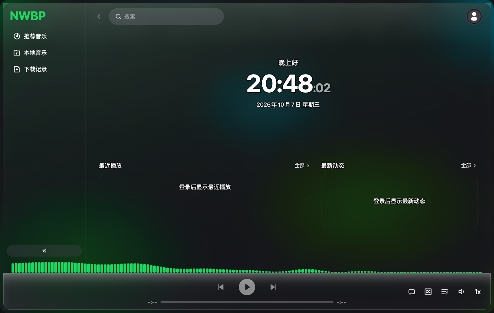
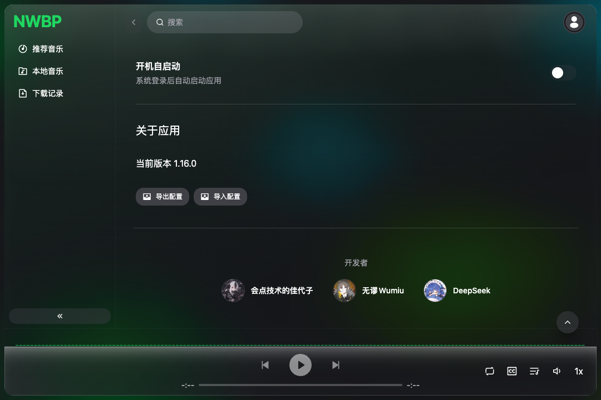

NWBP

  <b>Beta V 0.1.0</b>

  一个基于哔哩哔哩公开接口的跨平台桌面音乐播放器 🎧

  <b>macOS · Windows · Linux</b>

  非官方项目，与哔哩哔哩无任何官方关联或背书

  
  
  

⸻

📸 Preview

<table>
  <tr>
    <td width="50%" align="center">
      
      主页：问候语、时钟、最近播放、最新动态与播放栏
    </td>
    <td width="50%" align="center">
      
      设置：液态玻璃外观、主题与开发者信息
    </td>
  </tr>
</table>

⸻

📖 关于 NWBP

NWBP 是一个运行于桌面端的跨平台音乐播放器。

它以哔哩哔哩相关公开接口为主要内容来源，在用户登录并授权后，可以访问个人收藏夹、稍后再看、历史记录、关注等内容，并将这些内容作为个人媒体库进行播放。

同时，NWBP 集成了部分网易云音乐相关能力，并提供桌面歌词、视频下载、音频提取、频谱可视化、动态背景以及多种窗口模式等功能。

NWBP 由 wood3n/biu 派生而来，并在上游项目基础上对视觉设计、窗口系统、播放体验、桌面歌词、主页以及整体交互进行了较大规模的重新设计。

NWBP 是非官方第三方项目，与哔哩哔哩没有任何官方关联、授权或背书。

⸻

✨ Features

🎵 播放与媒体库

* B 站账号登录
    * 扫码登录
    * 短信登录
    * 密码登录
* 收藏夹
* 稍后再看
* 历史记录
* 我的关注
* 站内搜索
* 搜索历史
* 最近播放
* 全屏播放器
* Mini Player
* 底部播放栏
* 动态音频频谱

⸻

🎧 音频

* 根据账号权限获取可用的较高质量音频流
* 支持高码率音频播放
* 音频提取
* 视频下载
* 收藏夹批量下载

实际可用的音频质量取决于视频源、账号权限以及平台当前提供的资源。

⸻

☁️ 网易云音乐相关功能

NWBP 使用 ncm-player 项目的部分实现，为应用提供网易云音乐相关功能。

目前主要用于：

* 网易云音乐相关数据能力
* 歌词来源
* 网易云音乐相关播放辅助功能

相关代码经过 NWBP 的项目结构与 UI 进行适配。

网易云音乐相关功能并不代表 NWBP 与网易云音乐存在任何官方合作、授权或关联。

⸻

📝 桌面歌词

NWBP 的桌面歌词功能参考并使用了 Lyrimuse 提供的相关实现。

在此基础上，NWBP 对桌面歌词的视觉效果与交互进行了进一步设计。

支持：

* 独立置顶窗口
* 自由拖动
* 字号调整
* 歌词显示动画
* 透明底板
* 纯色底板
* 自定义背景
* 背景与文字独立透明度
* 右键菜单
* 可选频谱条

歌词源支持：

* 网易云音乐
* LRCLIB

⸻

🧊 Liquid Glass

NWBP 采用低填充、低模糊的玻璃化视觉设计。

支持：

* 浅色 / 深色主题
* 自定义主色
* 自定义背景图片
* 背景模糊
* 背景压暗
* 可调圆角
* 半透明应用面板
* 圆角窗口
* 透明背景
* 系统托盘

设计目标不是简单地将界面处理成高模糊的“毛玻璃”，而是在透明度、背景、内容和层次之间保持清晰的视觉关系。

⸻

🎬 启动动画

支持多种应用启动动画：

* 无
* 淡入
* 图标
* 呼吸
* 自定义视频

⸻

🏠 主页

打开 NWBP 后直接进入主页：

* 个性化问候语
* 实时时钟
* 最近播放
* 最新动态
* 播放控制

⸻

🧩 相比上游的主要改动

NWBP 不只是简单修改主题，而是在上游项目的基础上进行了较大范围的 UI 与体验重构。

🎨 品牌与视觉

* 品牌名称改为 NWBP
* 侧栏采用纯文字品牌设计
* 应用主体改为一整块浮起的圆角玻璃面板
* 重构液态玻璃视觉效果
* 增加浅色 / 深色主题
* 增加自定义背景系统

📝 桌面歌词重构

重新设计桌面歌词窗口：

* 可拖动
* 可调整字号
* 多种动画
* 右键菜单
* 三种底板模式
* 背景 / 文字独立透明度
* 可选频谱显示

🏠 新增主页

新增完整主页系统：

* 问候语
* 实时时钟
* 最近播放
* 最新动态

🎵 播放栏与频谱

新增播放栏动态音频条。

桌面歌词增加可选频谱条，并与全屏播放器共享同一套频谱模块。

🎬 启动动画

新增应用启动动画系统，并支持自定义视频。

🪟 窗口与托盘

* macOS 补齐托盘图标
* 关闭主窗口后应用仍可驻留
* 支持 Mini Player
* 支持独立桌面歌词窗口
* 支持透明窗口

🛠 其他调整

* 移除自动更新链路
* 移除 electron-updater
* 修复液态玻璃模式下部分文字与滑块对比度不足的问题
* 页面切换增加短暂加载反馈
* 设置页增加开发者署名

⸻

📦 构建与安装

当前版本暂未提供官方签名安装包。

构建产物位于：

dist/artifacts/

支持：

平台	架构 / 格式
macOS	Apple Silicon / Intel
Windows	x64 / ARM64
Linux	Electron Builder 支持的目标架构

Windows 支持：

* NSIS 安装包
* Portable 免安装版本

macOS / Windows 同时提供 ZIP 版本。

当前版本没有进行代码签名或公证。

macOS 首次运行时，如果系统阻止应用打开，可以通过“右键 → 打开”或“系统设置 → 隐私与安全性”允许应用运行。

Windows 如果出现 SmartScreen 提示，请确认来源后选择继续运行。

⸻

🚀 本地开发

环境要求

* Node.js 22.17.1
* pnpm 10.x
* Electron 38

项目使用 .nvmrc / package.json 指定 Node.js 版本。

.npmrc 开启：

engine-strict=true

因此建议严格使用 Node.js 22.17.1。

安装

corepack enable
pnpm install

开发

pnpm dev

该命令会启动 Rsbuild 开发环境并自动启动 Electron。

⸻

🛠 常用命令

命令	用途
pnpm dev	启动开发环境
pnpm build	构建并打包当前平台
pnpm test	运行 Vitest 测试
pnpm knip	检查未使用的文件与导出
npx tsc --noEmit	TypeScript 类型检查
npx eslint src electron shared plugins tests	ESLint 检查

⸻

📦 多平台构建

默认：

pnpm build

只构建当前操作系统。

如果需要一次构建多个平台：

NWBP_BUILD_TARGET=mac,win pnpm build

支持：

mac
win
linux

例如：

NWBP_BUILD_TARGET=mac,win,linux pnpm build

构建流程开始时会清理 dist。

因此不建议分别执行多次 pnpm build，否则后一次构建可能会删除前一次生成的安装包。

⸻

🍎 macOS 构建

macOS 构建需要完整的 Xcode。

由于项目使用 macOS .icon 格式，Electron Builder 会调用 actool。

建议：

DEVELOPER_DIR=/Applications/Xcode.app/Contents/Developer \
NWBP_BUILD_TARGET=mac \
pnpm build

如果只安装 Command Line Tools 而没有完整 Xcode，可能出现：

Failed to check actool version.
Is Xcode 26 or higher installed?

⸻

🪟 在 macOS 上构建 Windows

首次构建 Windows 版本时，Electron Builder 会自动下载 Windows 所需的 Electron、NSIS 和相关工具。

如果网络环境不佳，可以使用镜像：

ELECTRON_MIRROR=https://npmmirror.com/mirrors/electron/ \
ELECTRON_BUILDER_BINARIES_MIRROR=https://npmmirror.com/mirrors/electron-builder-binaries/ \
NWBP_BUILD_TARGET=win \
pnpm build

⸻

📁 项目结构

NWBP/
├── src/
│   ├── components/       # 通用 UI 与播放器组件
│   ├── pages/            # 页面
│   ├── layout/           # 应用布局
│   ├── store/            # Zustand 状态管理
│   └── common/           # 通用工具与常量
│
├── electron/
│   ├── ipc/              # IPC 处理器
│   ├── windows/          # 窗口管理
│   └── ffmpeg/           # FFmpeg
│
├── shared/                # 主进程 / 渲染层共享类型
├── plugins/               # Rsbuild / Electron Builder 配置
├── tests/                 # 测试
├── screenshots/           # README 截图
├── LICENSE
└── package.json

⸻

🔐 账号与权限

NWBP 不提供独立的账号系统。

登录功能用于访问用户自己的哔哩哔哩账户及其可访问内容。

请勿：

* 分享自己的登录凭据
* 使用他人的账号进行未经授权的操作
* 绕过会员或权限限制
* 进行大规模自动化请求
* 进行恶意爬取
* 绕过 DRM 或其他技术保护措施

使用 NWBP 时，请遵守相关平台的用户协议、社区规则以及所在地适用的法律法规。

⸻

📜 Third-party Projects

NWBP 使用、参考或集成多个开源项目。

感谢所有相关项目的作者、维护者以及贡献者。

项目	用途
wood3n/biu	NWBP 的上游项目
ncm-player	网易云音乐相关功能
Lyrimuse	桌面歌词相关功能
bilibili-API-collect	哔哩哔哩 API 研究与参考
HeroUI	UI 组件
Rsbuild	构建工具链
Electron	跨平台桌面应用运行环境
FFmpeg	音视频处理

第三方项目的版权、商标及许可证归其各自作者或权利人所有。

⸻

📚 Acknowledgements

特别感谢：

wood3n/biu

NWBP 的上游项目。

感谢上游项目提供的播放器基础架构以及相关实现。

ncm-player

NWBP 使用其部分实现，为网易云音乐相关功能提供基础。

Lyrimuse

NWBP 的桌面歌词功能使用并参考了其相关实现，并在此基础上进行了进一步的 UI 与交互设计。

SocialSisterYi/bilibili-API-collect

长期收集与整理哔哩哔哩 API，为 NWBP 相关接口研究提供了重要参考。

HeroUI / Rsbuild / Electron / FFmpeg

感谢这些优秀的开源项目为 NWBP 提供基础能力。

⸻

📄 License

NWBP 使用：

PolyForm Noncommercial License 1.0.0

本项目允许非商业用途的使用、修改与研究，但禁止商业用途。

禁止但不限于：

* 销售软件
* 收费服务
* 广告变现
* 商业集成
* 将本项目作为商业产品的一部分

完整许可条款请参阅：

LICENSE

SPDX：

PolyForm-Noncommercial-1.0.0

Upstream Copyright

本项目基于 wood3n/biu 派生开发。

根据上游项目相关许可要求，本项目保留：

Copyright (c) 2022–2025 wood3n

⸻

👥 Developers

头像	开发者
	会点技术的佳代子
	无谬Wumiu
	DeepSeek

开发者信息同时显示于：

设置 → 常规设置 → 页面底部

⸻

⚖️ Legal Notice

NWBP 是一个非官方第三方项目。

* NWBP 与哔哩哔哩没有任何官方关联、授权或背书。
* Bilibili、哔哩哔哩及其相关名称、商标与标识归其各自权利人所有。
* 本项目不主张拥有相关平台的知识产权。
* 本项目仅供学习、研究与个人使用。
* 严禁将本项目用于商业用途。
* 用户应自行确保其使用方式符合相关平台规则及适用法律法规。
* 项目不会以任何形式鼓励绕过会员权限、DRM 或其他访问控制措施。
* 实际可访问的内容与音频质量取决于用户账号权限、资源本身以及平台当前提供的接口。
* 因用户违反平台规则、法律法规或第三方权利而产生的责任，由使用者自行承担。

如果发现涉及版权、许可证、合规或其他权利问题，欢迎通过 GitHub Issues 联系项目维护者。

⸻

⭐ Support

如果 NWBP 对你有帮助，欢迎给项目一个 ⭐ Star。

你的支持会帮助 NWBP 继续完善：

跨平台体验 · 音乐播放 · Liquid Glass UI · 桌面歌词 · 更多桌面功能

  <b>NWBP</b> 
  Not just a player.

